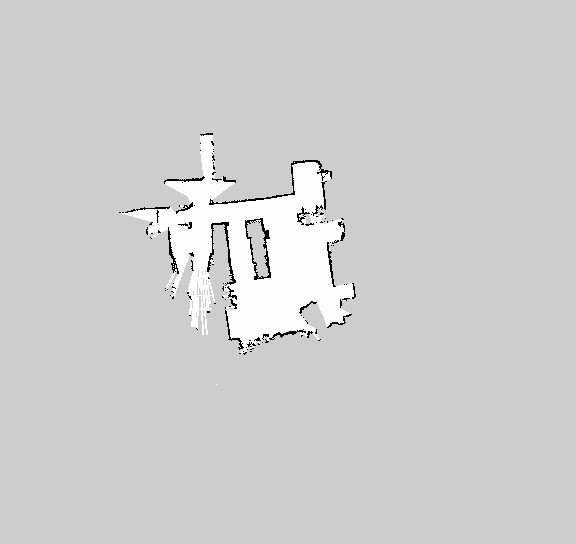
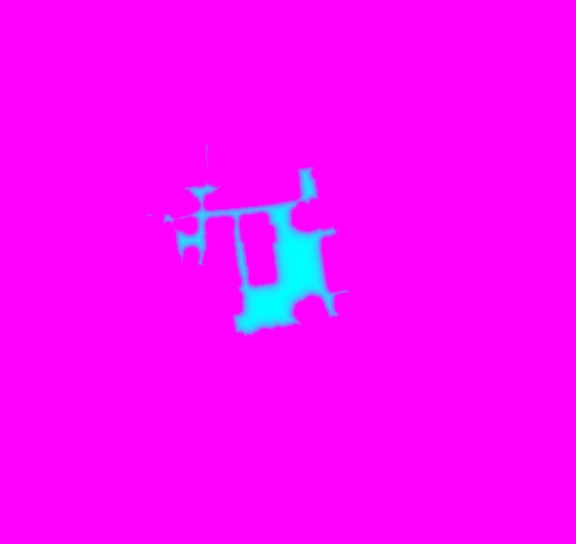
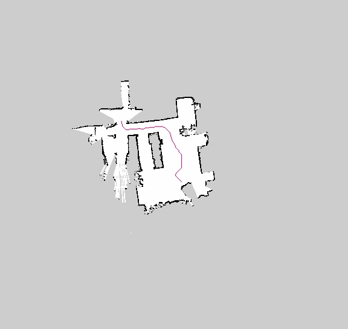

pathfinding

## About
The idea is to use ROS occupancy grid maps to perform some path planning, for the sake of efficiciency I made everything in C++ and OpenCV.

Algorithms Implemented:
* Breadth First Search
* Dijkstra
* A* - Euclidean distance Heuristic

| 1. Input Occupancy Map | 2. Pixel Distance Map | 
|:-------------------------:|:-------------------------:|
| |  |
| **3. Cost Map** | **4. Path Map Overlay** |
| |  |

## TODO
* Convert the path from cell coordinatrs to cartesian using the map metadata from the **.yaml** files.

## References
* [Red Blob Games](https://www.redblobgames.com/pathfinding/a-star/implementation.html#cplusplus)
* [ROS Wiki on 2D costmaps](http://wiki.ros.org/costmap_2d)
* [ros-planning on github](https://github.com/ros-planning/navigation)
* [OpenCV distance transform](https://docs.opencv.org/3.4/d2/dbd/tutorial_distance_transform.html)
